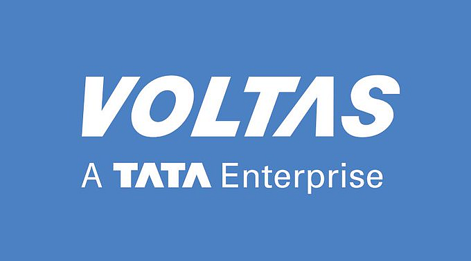

# Financial Analysis of Voltas

This project is a comprehensive financial analysis of **Voltas Ltd.**

## Objective
To assess the financial health and strategic direction of Voltas Ltd. by applying core concepts of financial management, including valuation techniques, leverage analysis, and policy assessments.

## Project Scope

1. **5-Year Financial Projections & NPV Analysis**
   - Forecasted financial statements using historical data and assumptions.
   - Calculated Net Present Value (NPV) using the Discounted Cash Flow (DCF) method.
   - Incorporated industry-relevant discount rates for investment viability.

2. **EBIT-EPS Analysis**
   - Examined the impact of financial leverage on Earnings Per Share (EPS).
   - Compared different financing scenarios (equity vs. debt) to assess risk and return tradeoffs.

3. **Working Capital Management Policy Analysis**
   - Evaluated the efficiency of current asset and liability management.
   - Analyzed ratios such as Current Ratio, Quick Ratio, Inventory Turnover, and Receivables Turnover.

4. **Dividend Policy Analysis**
   - Studied historical dividend patterns, payout ratios, and retained earnings.
   - Interpreted the company’s dividend approach in context of growth strategy and liquidity.

## Tools & Techniques
- **Microsoft Excel**: Financial modeling, scenario analysis, and ratio computation.
- **Financial Ratio Analysis**
- **DCF Valuation**
- **Leverage Metrics**

## File Structure

- `Financial Management Project(1).xlsx` – Contains all financial projections, NPV calculations, ratio analysis, and charts.

## Conclusion
The analysis provided actionable insights into Voltas Ltd.’s investment potential, leverage risks, operational efficiency, and capital allocation policies. It also enhanced practical skills in financial modeling and strategic evaluation.

---

**Author:** Srishti Gupta  
**Contact:** gsrishti2003@gmail.com  
**Institution:** Delhi School of Management, DTU

